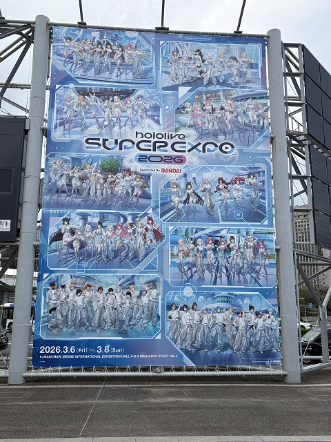
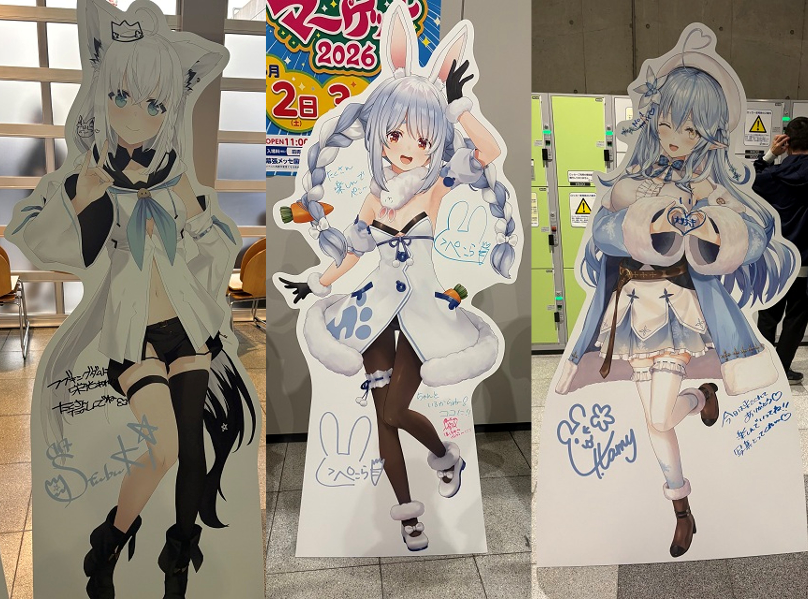

## はじめに

2026/3/6〜8に開催された「hololive SUPER EXPO 2026 &
hololive 7th fes. Ridin' on Dreams」に参加しました。

チケットが当選したのは、 **初日のフェス（Stage1）** と、
 **2日目のエキスポ（ファストチケットあり）** でした。

ホロライブは3年ほど応援しており、
個人や期生のライブには参加したことがありますが、
エキスポやフェスに参加するのは今回が初めてです。

そこで、実際に参加して感じたことなどをまとめてみたいと思います。

この記事では、 **初日のフェス（Stage1）** に参加した感想を書いていきます。

 [2日目のエキスポの感想はこちら](https://myblog-ee8.pages.dev/posts/hololive_expofes2026_day2/)

## 会場着～フェス開始まで

会場は幕張メッセでした。

フェスは17時開場、18時30分開演だったので、
少し早めの15時半ごろに会場である幕張メッセに到着しました。

<figure>
    
    
<figcaption>会場入り口の垂れ幕の写真</figcaption>

</figure>

事前に情報が出ていましたが、
ライブ参加者はエキスポ会場には入れないものの、
展示ホール前の通路エリアには立ち入ることができました。

通路には **おでむかえ等身大パネル** が設置されており、
ライブ開始までの時間を使って、
行列に並びながら写真を撮ることができました。

<figure>
    
    
<figcaption>推しホロメンの等身大パネル</figcaption>

</figure>

さて、座席はチケットに記載されている **I-8ブロック** です。

近年は事前に座席位置がわからないことが多く、
どの席になるかは会場に入ってからのお楽しみです。

入場して座席を見つけると、
なんと**メインステージに向かってやや左側の3列目という良席**でした！

「これがホロライブファンクラブ最速先行チケットの力か！」
と思わず感じてしまいました。

ちなみにメインステージは会場の両端に2か所あるため、
一方のステージに近い席は、もう一方のステージからは最後方になります。

## フェス開始！

フェスは全員で歌う **Color Rise Harmony** から始まりました。

そして歌が始まると、なんと**トロッコ**が登場！

トロッコ演出はこれまでのVTuberライブ配信でも見たことはありましたし、
会場マップを見たときから「もしかして」と思っていましたが、
自分が実際に会場で体験するのは初めてでした。

トロッコが会場内を回ることで、
観客の近くまで来られるようになり、
これまでのVTuberライブの枠組みを大きく超える演出になっていたと思います。

今まではVTuberの特性上、
メインステージ中央付近にしか登場できないという制約がありました。

そこにトロッコが加わることで、
**表現の幅が大きく広がった**と感じました。

自分の座席の位置的には、
残念ながらトロッコが近くに来ることはありませんでしたが、
今後の演出や技術の進化には大いに期待したいところです。

## フェスの楽曲感想

フェスのセットリストは公式から発表されている通りですが（[リンク](https://x.com/hololivetv/status/2029887686631379106)）、
ここでは特に印象に残った楽曲を中心に感想を書いていきます。

最推しの雪花ラミィちゃんの「**無敵☆本気だサバイバー！**」はやっぱり最高でした。

曲が発表された時からライブ映えする曲だと思っていましたが、
予想通り会場も自分も大盛り上がりでした。

そして、兎田ぺこらちゃんの「**ぺこぺこ!!チキンフィーバー☆**」。

3期生ライブでも聴いているのですが、
この曲の楽しさは本当に異常レベルです。
また聴くことができて、とても嬉しかったです。

そして、一伊那尓栖ちゃんの「**TAKO∞TAKOVER**」。

恥ずかしながらこの曲は知らなかったのですが、
可愛い楽曲と、どこか禍々しいMVのミスマッチが印象的で、
個人的にすごく心に残りました。

## ライブライブの曲が多かった

今回のフェスでは、
**ラブライブの楽曲が多かった** のも個人的にはとても嬉しいポイントでした。

- 輝夜の城で踊りたい
- 愛♡スクリ～ム！
- Snow halation

何しろ自分は10年来のラブライバーでもあるので、
ラブライブの曲が流れた瞬間にテンションが一気に上がってしまいました。

特に、雪花ラミィちゃん × 博衣こよりちゃんによる「**Snow halation**」。

推しが推しの曲を歌うという、
これ以上ないほどの感動的な瞬間でした。

## おわりに

自分はゆるい箱推しなので、
特に海外勢を中心に、全員を詳しく知っているわけではありません。

ですが、
知っている曲も知らない曲も含めて楽しめるのが大型フェスの醍醐味だと思っています。

今回のフェスで初めて知った曲の中にも、
「これは良い！」と思える曲がいくつもありましたし、
こういう機会がなければ出会えなかった楽曲も多かったと思います。

とても楽しい時間でした。
ありがとうございました。

---

 [2日目のエキスポの感想はこちら](https://myblog-ee8.pages.dev/posts/hololive_expofes2026_day2/)