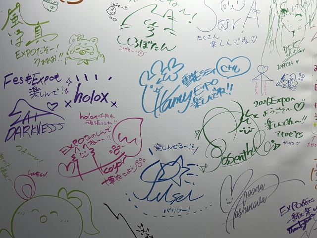
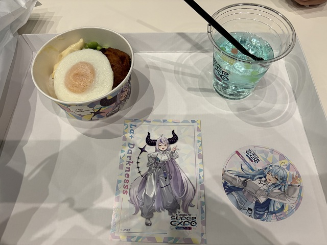
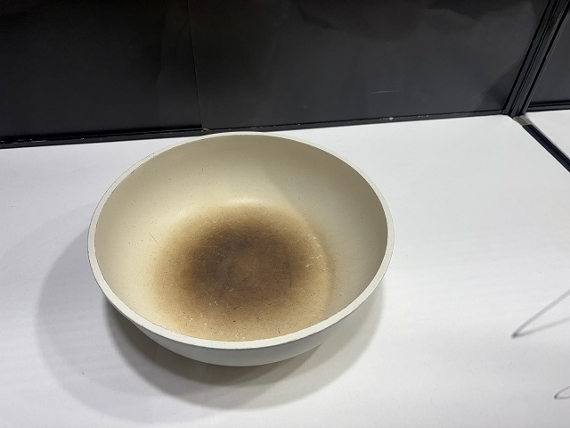

## はじめに

2026/3/6〜8に開催された「hololive SUPER EXPO 2026 &
hololive 7th fes. Ridin' on Dreams」に参加しました。

チケットが当選したのは、 **初日のフェス（Stage1）** と、
 **2日目のエキスポ（ファストチケットあり）** でした。

 [前回の記事](https://myblog-ee8.pages.dev/posts/hololive_expofes2026_day1/)では初日のフェスの感想を書きましたが、
 今回の記事では **２日目のエキスポ** に参加した感想を書いていきます。

 ## 朝～入場まで

初日のフェスを終えた翌日は、エキスポに参加しました。

ファストチケットの番号は「**Kブロック**」。
集合時間は7:20〜だったので、遅れないように会場に到着しました。

入場はA〜Qブロックまで順番通りに行われるため、
Kブロックだと11/17番目の入場になります。

エキスポのチケットも抽選、ファストチケットも抽選、
さらにブロック順も抽選になるので、
早い段階で入場できるのはかなりの豪運の人になります。

ブロック内の順番は先着なのですが、
自分は半分よりやや後ろくらいの順番でした。

1つのブロックは200〜300人くらいでしょうか。

最大の狙いは、雪花ラミィちゃんのモニタリングトーク整理券。
ただ、順番的におそらく厳しいだろうなと思っていました。

## 入場～モニタリングトーク整理券～サインウォール

それでも一縷の望みをかけて、
入場後はモニタリングトーク整理券の配布場所を目指します。

整理券の列が進むにつれて聞こえてくるのは、
「配布終了のお知らせ」。

ラミィちゃん、おかゆん、フワモコ、こよちゃんと
次々と配布が終了していきます。

そして、自分が受け取れたのは
**角巻わためちゃんのモニタリングトーク**でした！

わためぇはマイクラ配信などでもよく見ていたので、
整理券をゲットできて嬉しかったです。

モニタリングトーク整理券のあとは、
ファストチケットの利点を活かして、
人が少ない時間帯に混みそうな場所を回ろうと思い、
**サインウォール**の列に並びました。

列の長さ的にはそれほどでもないかなと思ったのですが、
何せ参加タレントのサインが大量に書いてあり、
みんながそれぞれ1つずつ写真に収めていくので、
列の進みがかなり遅いです。

<figure>
    
    
<figcaption>たくさんのサインが書かれている</figcaption>

</figure>

結局、1時間半ほどでサインウォールを見終わることができました。

## 企業ブース～昼食～モニタリングトーク（雪花ラミィ、角巻わため）

この時点で11時過ぎになっていたので、
11:40のホロライブファンクラブ特典受け取りと、
12:00の昼食受け取りの時間が近づいていました。

企業ブースの方に行き、
さっと見られるブースを軽く回ってから昼食にしました。

<figure>
    
    
<figcaption>お昼ご飯と特典</figcaption>

</figure>

13:30から**ラミィちゃんのモニタリングトーク**が開始されるので、
整理券は持っていませんでしたが、
立ち見は可能とのことだったため、
少し早めに行って場所取りをしました。

そのあとは、
**わためぇのモニタリングトーク**に整理券で入場。

2人ともさすが配信者で、
トークの回し方がとても上手で、すごく面白かったです。

何より、普段は配信のチャットくらいしか交流の機会がありませんが、
直接ファンとのやり取りが見られるのが本当によかったです。

自分は指名されることはありませんでしたが、
それでも他のファンと楽しそうに交流するホロメンを見ているだけで、
幸せな気持ちになりました。

## ホロドリ～タイムカプセル～企業ブース

その後は、事前登録が始まった **ホロドリ（Hololive Dreams）** のブースを見に行きました。

こちらは比較的空いていてよかったです。

続いて、 **タイムカプセル（ホロメンの私物展示）** を見に行きました。

3時間待ちの行列だと聞いていたので迷ったのですが、
せっかくなので並んでみることにしました。

列は

- ①0～2期生
- ②3～5期・HoloX・ID
- ③DEV_IS・EN

の3つに分かれていたので、
自分は②の列に並びました。

結果として、1時間半ほどで見終わることができました。
（全部見ようと思うと、軽く3時間は超えると思います）

<figure>
    
    
<figcaption>ぺこちゃんの鍋</figcaption>

</figure>

大人気だったぺこちゃんの配信でよく見るあの鍋を見ることができて感動しました。

想像よりかなり~~きたｎ~~使い込まれていて、
見た瞬間ちょっと笑ってしまいました。

ラミィちゃんはYouTubeからもらった銀盾と金盾を展示していました。

金盾は思ったよりも大きくて、かなり立派でした。

いつも配信で見える場所に置いてあるそうで、
普段の配信を見守っているものが目の前にあると思うと、
とても感慨深いです。

最後に、並べば入れた

- 明利酒造
- グッドスマイルカンパニー

のブースを見学して、会場を後にしました。

## おわりに

めちゃめちゃ疲れました。

朝から一日歩き回り、
行列に並び続けて10時間以上。

今回は1日だけの参加でしたが、
もしエキスポに2日間参加していたら、
2日目はかなり大変だったと思います。

自分の体力と相談して、
参加日数や回るブースをしっかり考える必要があるなと感じました。

それでも、すごく楽しかったです。

普段は画面越しでしか会えないホロメンを身近に感じられる瞬間がたくさんありました。

本当にいいイベントでした。
ありがとうございました。

---

[初日（フェスStage1）の感想はこちら](https://myblog-ee8.pages.dev/posts/hololive_expofes2026_day1/)