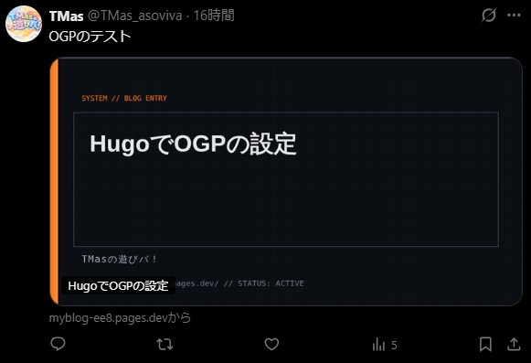
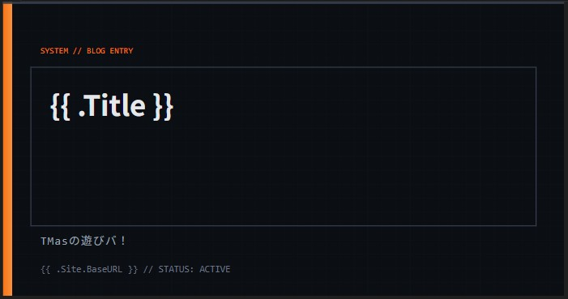
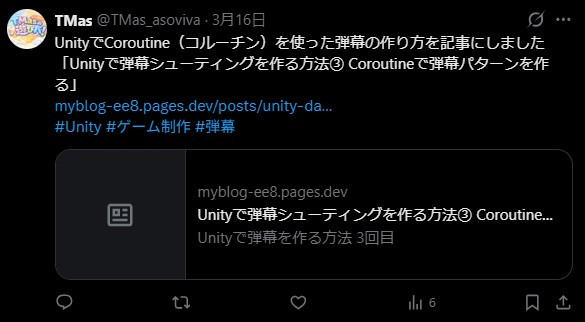

## はじめに

ブログの記事をSNSでシェアしたときに、
サムネイル画像が表示されると見た目の印象が大きく変わります。

特にX（旧Twitter）では、
画像の有無でクリック率がかなり変わると言われています。

今回は、静的サイトジェネレーターであるHugo（PaperModテーマ）を使って、
記事ごとにOGP画像を自動生成する仕組みを構築しました。

SVGをベースにした柔軟なデザインと、
自動化による運用のしやすさを両立した構成になっています。

一度構築してしまえば、記事を追加するとOGP画像が自動生成されるため、
運用コストを増やさずに見た目を強化できます。

今回の内容を実行すると、
X（旧Twitter）に投稿したときの見た目はこのようになります。

<figure>
    
    <center><figcaption>OGP設定後の投稿画像</figcaption></center>
</figure>

## OGPとは

OGP（Open Graph Protocol）とは、
Webページの情報をSNSで正しく表示するための仕組みです。

例えば、記事URLをシェアしたときに以下のような情報が表示されます。

- タイトル
- 説明文
- サムネイル画像

これらはHTML内のmetaタグで指定します（headタグ内に記述）。

```html
<meta property="og:title" content="記事タイトル">
<meta property="og:description" content="記事の説明">
<meta property="og:image" content="画像URL">
```

この設定がない場合、SNS側が自動で情報を取得しますが、
意図しない表示になることもあります。

そのため、OGPを明示的に設定することが重要です。

## SVG画像によるOGPのベースデザインの作成

まずはOGP画像のテンプレートとなるSVGを作成します。

今回は ```assets/ogp/single.svg``` に配置しました。

SVGを使うメリットは以下の通りです。

- テキストを動的に差し込める（タイトルなどの自動挿入が可能）
- 解像度に依存しない（高品質）
- 軽量で扱いやすい

見た目にもこだわって以下のSVGテンプレートを作成しました。

<figure>
    
    <center><figcaption>SVGのテンプレート</figcaption></center>
</figure>

```html
<svg width="1200" height="630" xmlns="http://www.w3.org/2000/svg">

<style>
.bg {
  fill: #0b0f14;
}

.title {
  font-size: 60px;
  fill: #e5e7eb;
  font-family: 'Noto Sans JP', sans-serif;
  font-weight: 700;
}

.site {
  font-size: 24px;
  fill: #9ca3af;
  font-family: monospace;
  letter-spacing: 2px;
}

.url {
  font-size: 20px;
  fill: #6b7280;
  font-family: monospace;
}

.label {
  font-size: 18px;
  fill: #f97316;
  font-family: monospace;
}
</style>

<defs>
  <!-- アクセント -->
  <linearGradient id="accent" x1="0" y1="0" x2="1" y2="0">
    <stop offset="0%" stop-color="#f97316"/>
    <stop offset="100%" stop-color="#fb923c"/>
  </linearGradient>

  <!-- 細かいグリッド -->
  <pattern id="grid" width="30" height="30" patternUnits="userSpaceOnUse">
    <path d="M30 0 L0 0 0 30" fill="none" stroke="#1f2937" stroke-width="1"/>
  </pattern>
</defs>

<!-- 背景 -->
<rect width="1200" height="630" class="bg"/>
<rect width="1200" height="630" fill="url(#grid)" opacity="0.3"/>

<!-- 左パネル -->
<rect x="0" y="0" width="20" height="630" fill="url(#accent)"/>

<!-- 上部ライン -->
<rect x="0" y="0" width="1200" height="4" fill="#374151"/>

<!-- UIボックス -->
<rect x="60" y="140" width="1080" height="340"
      fill="none" stroke="#374151" stroke-width="2"/>

<!-- コーナー装飾 -->
<line x1="60" y1="140" x2="120" y2="140" stroke="url(#accent)" stroke-width="3"/>
<line x1="60" y1="140" x2="60" y2="200" stroke="url(#accent)" stroke-width="3"/>

<!-- ラベル -->
<text x="80" y="110" class="label">
SYSTEM // BLOG ENTRY
</text>

<!-- サイト名 -->
<text x="80" y="520" class="site">
TMasの遊びバ！
</text>

<!-- タイトル -->
<foreignObject x="100" y="180" width="1000" height="260">
  <div xmlns="http://www.w3.org/1999/xhtml"
       style="
         font-family: 'Noto Sans JP', sans-serif;
         font-size: 60px;
         font-weight: 700;
         color: #e5e7eb;
         line-height: 1.3;
         word-break: break-word;
       ">
    {{ .Title }}
  </div>
</foreignObject>

<!-- 下部ステータス -->
<text x="80" y="580" class="url">
{{ .Site.BaseURL }} // STATUS: ACTIVE
</text>

</svg>
```

タイトルやサイト名を差し込めるように、以下のようにテンプレート化しておきます。

- {{ .Title }}
- {{ .Site.BaseURL }}

また、foreignObjectを使用して、
タイトルが長い場合に自動で折り返すように設定しています。

※ただし、ImageMagickなど一部のツールではforeignObjectが正しく描画されないため、
環境によってはtext要素で代替する必要があります。

これにより、記事ごとに異なるOGP画像を自動生成できるようになります。

## SVGの自動作成

次に、Hugoのテンプレート機能を使ってSVGを自動生成します。

PaperModのテーマではデフォルトでOGPを設定しているので、
無効化するために、空っぽの ```layouts/partials/templates/opengraph.html```と
```layouts/partials/templates/twitter_cards.html```を作成します。

これはHugoのルールとして**layouts/ が themes/ を上書きする**というものがあるからです。

そして、自分専用のOGPを設定するために```layouts/partials/ogp.html``` を作成します。

```html
{{ if .IsPage }}

{{ with resources.Get "ogp/single.svg" }}
{{ $svg := . | resources.ExecuteAsTemplate (printf "ogp/%s.svg" $.File.BaseFileName) $ }}
{{ $png := replace $svg.Permalink ".svg" ".png" }}

<meta property="og:title" content="{{ $.Title }}">
<meta property="og:description" content="{{ $.Description }}">
<meta property="og:type" content="article">
<meta property="og:url" content="{{ $.Permalink }}">
<meta property="og:image" content="{{ $png }}">

<meta name="twitter:card" content="summary_large_image">
<meta name="twitter:image" content="{{ $png }}">
<meta name="twitter:title" content="{{ $.Title }}">
<meta name="twitter:description" content="{{ $.Description }}">

{{ end }}

{{ end }}
```

ここでは、resources.ExecuteAsTemplate を利用して、
記事タイトルやサイト情報をSVGテンプレートに埋め込んでいます。

また、次の章でSVGをPNGに変換するため、
imageの場所にはsvgではなくpngを指定するようにしています。

これにより、タイトルなどの情報をブログの記事に埋め込むことができます。

## SVGからPNGへの変換

X（旧Twitter）はSVG画像に対応していないため、
OGP画像として使用するにはPNG形式に変換する必要があります。

今回はPythonを使って、
自動でSVGをPNGに変換する仕組みを作成しました。

<div style="font-size:0.9em;color:gray;">svg2png_converter.py</div>

```python
import sys
from pathlib import Path

CANVAS_WIDTH = 1200
CANVAS_HEIGHT = 630
BG_COLOR = "#0f172a"

SVG_DIR = Path("public/ogp")
PNG_DIR = Path("static/ogp")


def svg_to_png(svg_content: str, output_path: str):
    """PlaywrightでSVGをPNGに変換"""
    try:
        from playwright.sync_api import sync_playwright
    except ImportError:
        print("エラー: playwrightがインストールされていません", file=sys.stderr)
        sys.exit(1)

    html = f"""<!DOCTYPE html>
<html>
<head>
<meta charset="utf-8">
<style>
* {{ margin: 0; padding: 0; }}
body {{ width: {CANVAS_WIDTH}px; height: {CANVAS_HEIGHT}px; overflow: hidden; background: {BG_COLOR}; }}
</style>
</head>
<body>
{svg_content}
</body>
</html>"""

    with sync_playwright() as p:
        browser = p.chromium.launch()
        page = browser.new_page(viewport={"width": CANVAS_WIDTH, "height": CANVAS_HEIGHT})
        page.set_content(html)
        page.wait_for_timeout(300)  # フォント読み込み待機
        page.screenshot(path=output_path, clip={
            "x": 0, "y": 0,
            "width": CANVAS_WIDTH,
            "height": CANVAS_HEIGHT
        })
        browser.close()


def main():
    if not SVG_DIR.exists():
        print(f"エラー: ディレクトリが見つかりません: {SVG_DIR}", file=sys.stderr)
        sys.exit(1)

    svg_files = list(SVG_DIR.glob("*.svg"))
    if not svg_files:
        print(f"SVGファイルが見つかりません: {SVG_DIR}")
        return

    PNG_DIR.mkdir(parents=True, exist_ok=True)

    converted = 0
    skipped = 0
    for svg_path in sorted(svg_files):
        png_path = PNG_DIR / svg_path.with_suffix(".png").name
        if png_path.exists():
            print(f"スキップ: {png_path.name} (既に存在)")
            skipped += 1
            continue

        print(f"変換中: {svg_path.name} → {png_path.name}")
        with open(svg_path, "r", encoding="utf-8") as f:
            svg_content = f.read()
        svg_to_png(svg_content, str(png_path))
        converted += 1

    print(f"\n完了: {converted}件変換, {skipped}件スキップ")


if __name__ == "__main__":
    main()
```

Microsoftが開発したブラウザ操作テストのplaywrightを使用して、
SVG画像をブラウザで表示し、
Screenshotを撮ってPNGを保存するようにしています。

public/ogp以下にあるSVGファイルを探索し、
PNGに変換していないSVGファイルを自動変換して、
static/ogp以下に保存することができます。

## X（旧Twitter）での変化

OGP設定前は、リンクを投稿してもテキストのみのシンプルな表示でした。

しかし、OGPを設定したことで以下のように変化しました。

<figure>
    
    
    <center><figcaption>OGP設定前（上側）、設定後（下側）の投稿画像</figcaption></center>
</figure>

特にタイムライン上での目立ち方が大きく変わり、
クリックされやすい状態になったと感じています。

視覚的な情報が増えることで、記事の内容も伝わりやすくなりました。

## おわりに

せっかく記事を作ったので、
多くの人に見てもらいたいと思いますよね。

OGPを設定することで、
SNS投稿時に記事を目立たせることができ、
クリック率の向上にもつながる有効な方法だと思います。

ありがとうございました。