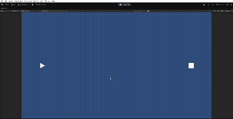

## はじめに

これから何回かにかけてUnityでの弾幕の作り方を記事にしようと思っています。

今回は最初の一歩というとこで、

- Unityでプロジェクトの作成
- GameObjectの作成（Player, Enemy, EnemyBullet）
- 基本的な動作のプログラム

をやっていこうと思います。

今回の内容を実行すると、以下のようなゲームが作れます。



## Unityでのプロジェクトの作成

UnityやUnity Hubのインストール方法は他の方の記事を参考にしてください。
（そのうち書くかもしれません）

今回のUnityのversionは **6000.3.10f1** です。

まずは、Unity Hubから新しいプロジェクトを作成します。

1. 新しいプロジェクト
2. テンプレートは「2D(Built-In Render Pipeline)」
3. プロジェクト名や保存場所を設定
4. プロジェクトを作成

これでプロジェクトが作成されました。

## Player, Enemy, EnemyBulletの作成

Unityのプロジェクトが立ち上がったら、シューティングの基本となるObjectを作成します。

今回は、Player（プレイヤー）を三角、Enemy（敵）を四角、EnemyBullet（敵の弾丸）を丸で作成します。
横画面で、プレイヤーが左、敵が右側にいる想定です。
上下にしたい方は適宜修正してください。

**Player**

1. Hierarchyで右クリック → 2D Object → Sprites → Triangle
2. 名前をPlayerにする
3. PlayerのInspectorのTransformで以下を設定する
    - Position: X:-7, Y:0, Z:0
    - Rotation: X:0, Y:0, Z:90
    - Scale: X:0.5, Y:0.5, Z:1

**Enemy**

1. Hierarchyで右クリック → 2D Object → Sprites → Square
2. 名前をEnemyにする
3. EnemyのInspectorのTransformで以下を設定する
    - Position: X:7, Y:0, Z:0
    - Rotation: X:0, Y:0, Z:0
    - Scale: X:0.5, Y:0.5, Z:1

**EnemyBullet**

1. Hierarchyで右クリック → 2D Object → Sprites → Circle
2. 名前をEnemyBulletにする
3. EnemyBulletのInspectorのTransformで以下を設定する
    - Position: X:0, Y:0, Z:0
    - Rotation: X:0, Y:0, Z:0
    - Scale: X:0.2, Y:0.2, Z:1
4. HierarchyのEnemyBulletをProjectにドラッグ＆ドロップしてPrefab化する

弾幕では敵の弾は大量に複数使用するので、Prefab化して利用すると便利です。

## 基本的なスクリプトを作る

それぞれのObjectに基本的なスクリプトを作成します。

### Playerのスクリプト

**やりたいこと**
- WASDキーもしくは矢印キーで上下左右に動く
- 画面の端までしか移動できないようにする
- 現時点では敵の弾丸との当たり判定や弾の発射はしない
    - ブログの目的が敵の弾幕の作成がメインだから

<div style="font-size:0.9em;color:gray;">PlayerMovement.cs</div>

```csharp
using UnityEngine;

// プレイヤーの移動処理を行うスクリプト
public class PlayerMovement : MonoBehaviour
{
    // プレイヤーの移動速度
    public float speed = 2f;

    void Update()
    {
        // キーボード入力を取得
        // Horizontal : A/Dキー または ←/→キー
        // Vertical   : W/Sキー または ↑/↓キー
        float moveX = Input.GetAxis("Horizontal");
        float moveY = Input.GetAxis("Vertical");

        // 移動方向ベクトルを作成
        // normalized を使うことで、斜め移動時の速度が速くなるのを防ぐ
        Vector3 movement = new Vector3(moveX, moveY, 0f).normalized;

        // プレイヤーの位置を移動させる
        // Time.deltaTime を掛けることでフレームレートに依存しない移動になる
        transform.position += movement * speed * Time.deltaTime;

        // プレイヤーの現在位置を取得し、画面外に出ないように制限する
        // Mathf.Clamp(値, 最小値, 最大値)
        // x座標は -8 ～ 8 の範囲に制限
        float x = Mathf.Clamp(transform.position.x, -8f, 8f);

        // y座標は -4 ～ 4 の範囲に制限
        float y = Mathf.Clamp(transform.position.y, -4f, 4f);

        // 制限後の座標をプレイヤーの位置として再設定
        transform.position = new Vector3(x, y, 0f);
    }
}
```

PlayerMovement.csができたら、Sceneの**Player**にドラッグしてアタッチします。

これでPlayerを自由に操作できるようになりました。

※ 画面端の判定がハードコーディングされているので、修正したほうがいいかもしれませんが、とりあえず進めます。

#### Input Systemのエラーが出たら

Playerのコントロールが旧Input Systemを使っているので、エラーが出る可能性があります。

```
InvalidOperationException:
You are trying to read Input using the UnityEngine.Input class
```

この場合はメニューバーから

1. Edit
2. Project Settings
3. Player
4. Other Settings
5. Both

にすると解決します（Unityの再起動が必要です）。

### EnemyBulletのスクリプト

**やりたいこと**

- 弾を左方向に移動させる
- 画面外に出たら弾を廃棄する

<div style="font-size:0.9em;color:gray;">EnemyBullet.cs</div>

```csharp
using UnityEngine;

// 敵が発射する弾の動作を制御するスクリプト
using UnityEngine;

// 敵が発射する弾の動作を制御するスクリプト
public class EnemyBullet : MonoBehaviour
{
    // 弾の移動速度
    public float speed = 5f;

    void Update()
    {
        // 弾を左方向に移動させる
        // Vector2.left は (-1, 0) を表し、画面の左方向を意味する
        // speed を掛けることで移動速度を調整
        // Time.deltaTime を掛けることでフレームレートに依存しない移動になる
        transform.Translate(Vector2.left * speed * Time.deltaTime);

        // 画面外に出たら弾を削除する
        CheckOutOfScreen();
    }

    // 画面外に出たかどうかをチェックする関数
    void CheckOutOfScreen()
    {
        // 現在の弾の位置を取得
        Vector3 pos = transform.position;

        // 画面外の範囲を設定（プレイヤーと同じ範囲より少し広め）
        if (pos.x < -10f || pos.x > 10f || pos.y < -6f || pos.y > 6f)
        {
            // 弾を削除
            Destroy(gameObject);
        }
    }
}
```

EnemyBullet.csができたら、Projectビューの **EnemyBulletのPrefab** にドラッグしてアタッチします。

ちなみに、Destroy / Instantiate を大量にすると重くなるため、Object Poolという方法を取るのが一般的ですが、まずはこの状態で進めます。

### BulletManagerのスクリプト

弾の生成処理を1箇所にまとめることで、
後から弾の最適化（ObjectPoolなど）を追加しやすくします。

<div style="font-size:0.9em;color:gray;">BulletManager.cs</div>

```csharp
using UnityEngine;

// 弾の生成を管理するクラス
public class BulletManager : MonoBehaviour
{
    // シングルトン（どこからでもアクセスできるようにする）
    public static BulletManager Instance;

    void Awake()
    {
        // 既にInstanceが存在する場合は削除
        if (Instance != null)
        {
            Destroy(gameObject);
            return;
        }

        Instance = this;
    }

    // 弾を生成するメソッド
    public GameObject SpawnBullet(GameObject bulletPrefab, Vector3 position, Quaternion rotation)
    {
        // 弾を生成
        GameObject bullet = Instantiate(bulletPrefab, position, rotation);

        return bullet;
    }
}
```

BulletManager.csができたら、Unity側で設定します。

1. 空のGameObjectを作って、名前をBulletManagerにする
2. BulletManager.cs をアタッチ

弾幕ゲームでは1画面に数百〜数千の弾が生成されることがあります。
そのため後の回では、Instantiateの負荷を減らすために
Object Poolを利用した弾管理の方法も紹介します。

### Enemyのスクリプト

やりたいこと
- Bullets（弾）一定間隔の時間で発射する
- 位置は固定（動かない）

<div style="font-size:0.9em;color:gray;">EnemyShooting.cs</div>

```csharp
using UnityEngine;

// 敵が一定時間ごとに弾を発射するスクリプト
public class EnemyShooting : MonoBehaviour
{
    [Header("弾の設定")]

    // 発射する弾のPrefab
    // Inspectorから設定する
    public GameObject bulletPrefab;

    // 弾を発射する位置
    // Enemyの子オブジェクトなどを指定しておくと便利
    public Transform firePoint;

    // 弾を発射する間隔（秒）
    public float fireInterval = 1.0f;

    // 発射タイミングを管理するタイマー
    private float timer;

    void Update()
    {
        // 毎フレーム、経過時間を加算する
        // Time.deltaTime は「前フレームからの経過時間（秒）」
        timer += Time.deltaTime;

        // 指定した発射間隔を超えたら弾を発射
        if (timer >= fireInterval)
        {
            Shoot();

            // タイマーをリセット
            timer = 0f;
        }
    }

    // 弾を発射する処理
    void Shoot()
    {
        // bulletPrefab を生成する
        // 位置 : firePoint.position
        // 回転 : firePoint.rotation
        BulletManager.Instance.SpawnBullet(
            bulletPrefab,
            firePoint.position,
            firePoint.rotation
        );
    }
}
```

EnemyShooting.csができたら、Sceneの**Enemy**にドラッグしてアタッチします。

次に、弾の設定をInspectorで設定します。

- Bullet Prefab: AAssetsのEnemyBulletのPrefabを指定
- Fire Point: 下記参照
- Fire interval: 0.5

Enemyの中心から発射されるように、FirePoint用にEnemyの子オブジェクトを作ります。

1. Enemyを右クリック
2. Create Empty
3. 名前を FirePoint にする
4. Positionを (0,0,0) にする

Inspectorで、Fire PointにこのFirePointを指定します。

Inspectorは以下のようになります。


## 動作確認

ここまでで作成した成果を確認してみましょう。UnityのHierarchyとProjectは以下のようになっていると思います。


ゲームをプレイすると以下のようになります。
（中心あたりにある白い点はマウスカーソルなので気にしないでください）


無事にシューティングゲームの基本ができていることが確認できました！

## これからの予定

今回は弾を発射するところまで作りました。

次回以降は、

- プレイヤー狙い弾
- N-way弾
- 円形弾幕
- 弾の管理方法の追加（Object Poolなど）

など、弾幕ゲームらしい弾のパターンを作っていきます。

ありがとうございました。