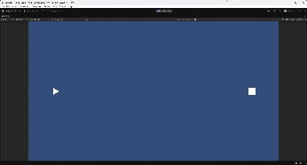
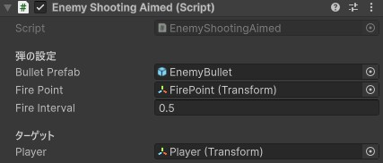

## はじめに

[前回](https://myblog-ee8.pages.dev/posts/unity-danmaku-1/)はUnityを使ったシューティングゲームの最初の一歩ということで、
PlayerとEnemyを作って、Enemyから弾がまっすぐ前に連続的に出るゲームを作りました。

今回は、Enemyからの弾がPlayerをめがけて飛んでくる自機狙い弾（プレイヤー狙い弾）を作っていきたいと思います。

今回の内容を実行すると、以下のようなゲームが作れます。



## 自機狙い弾の作成

### EnemyShootingAimed.csのスクリプト

自機狙い弾を作るには、

- Enemyの位置とPlayerの位置を取得
- EnemyからPlayerへの方向ベクトルを計算
- その方向に弾を出す

ことで作ることができます。

前回のEnemyShooting.csを少し改良して、
EnemyShootingAimed.csを作成します。

<div style="font-size:0.9em;color:gray;">EnemyShootingAimed.cs</div>

```csharp
using UnityEngine;

// 敵が一定時間ごとにプレイヤーに向けて（自機狙い）弾を発射するスクリプト
public class EnemyShootingAimed : MonoBehaviour
{
    [Header("弾の設定")]

    // 発射する弾のPrefab
    // Inspectorから設定する
    public GameObject bulletPrefab;

    // 弾を発射する位置
    // Enemyの子オブジェクトなどを指定しておくと便利
    public Transform firePoint;

    // 弾を発射する間隔（秒）
    public float fireInterval = 0.5f;

    [Header("ターゲット")]
    
    // Playerの位置を取得する
    public Transform player;  //★追加

    // 発射タイミングを管理するタイマー
    private float timer;

    void Update()
    {
        // 毎フレーム、経過時間を加算する
        // Time.deltaTime は「前フレームからの経過時間（秒）」
        timer += Time.deltaTime;

        // 指定した発射間隔を超えたら弾を発射
        if (timer >= fireInterval)
        {
            Shoot();

            // タイマーをリセット
            timer = 0f;
        }
    }

    // 弾を発射する処理
    void Shoot()
    {
        // bulletPrefab を生成
        // 位置 : firePoint.position
        // 回転 : firePoint.rotation
        GameObject bullet = BulletManager.Instance.SpawnBullet(
            bulletPrefab,
            firePoint.position,
            firePoint.rotation
        );

        // Playerの方向を計算
        Vector2 direction = (player.position - firePoint.position).normalized;  //★追加

        // 生成した弾に方向を設定
        EnemyBullet bulletScript = bullet.GetComponent<EnemyBullet>();  //★追加
        bulletScript.SetDirection(direction);  //★追加
    }
}
```

重要なのは、
```csharp
public Transform player;
```
で取得したプレイヤーの情報をもとに、
```csharp
Vector2 direction = (player.position - firePoint.position).normalized;
```
で弾の発射方向を計算していることです。

また、```normalized``` を使うことで、
長さ1のベクトル（方向だけのベクトル）を取得しています。

## EnemyBullet.csのスクリプト修正

前回作ったEnemyBullet.csも少し変更を加えます。

<div style="font-size:0.9em;color:gray;">EnemyBullet.cs</div>

```csharp
using UnityEngine;

// 敵が発射する弾の動作を制御するスクリプト
public class EnemyBullet : MonoBehaviour
{
    // 弾の移動速度
    public float speed = 5f;

    // 弾の移動方向
    private Vector2 direction;

    // 発射時に方向を設定する
    public void SetDirection(Vector2 dir) //★追加
    {
        direction = dir;
    }

    void Update()
    {
        // 弾をDirection方向に移動
        // speed を掛けることで移動速度を調整
        // Time.deltaTime を掛けることでフレームレートに依存しない移動になる
        transform.Translate(direction * speed * Time.deltaTime);

        // 画面外に出たら弾を削除する
        CheckOutOfScreen();
    }

    // 画面外に出たかどうかをチェックする関数
    void CheckOutOfScreen()
    {
        // 現在の弾の位置を取得
        Vector3 pos = transform.position;

        // 画面外の範囲を設定（プレイヤーと同じ範囲より少し広め）
        if (pos.x < -10f || pos.x > 10f || pos.y < -6f || pos.y > 6f)
        {
            // 弾を削除
            Destroy(gameObject);
        }
    }
}
```

弾の移動方向を変更できるように、
```csharp
public void SetDirection(Vector2 dir)
```
を追加しました。

前回の左側まっすぐに撃つ場合は、Vector2.leftを指定すれば同じ動きになります。

## 動作確認

EnemyShootingAimed.csをEnemyにアタッチして、
Inspectorで必要な部分を指定します。

EnemyのInspectorは以下のようになります。



ゲームをプレイすると以下のようになります。


Playerの方向に向かって弾が飛んで行っているのがわかると思います。

## これからの予定

今は自機狙いの連続弾でしたが、自機狙い弾の打ち方を変えることもできます。
例えば、「5発撃って、1秒休んで、また5発撃つ」を繰り返すなど。

これは次回の記事にしたいと思います。

上記に加えて、新しい弾幕や技術も記事にしていきます。

- N-way弾
- 円形弾幕
- 弾の管理方法の追加（Object Poolなど）

ありがとうございました。