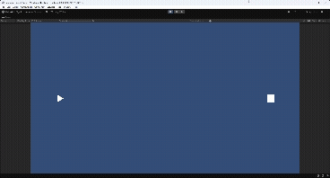
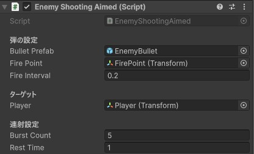
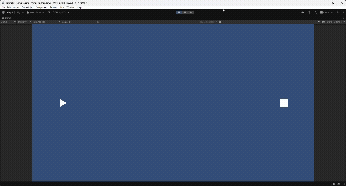

## はじめに

[前回](https://myblog-ee8.pages.dev/posts/unity-danmaku-2)は自機狙い弾という、
プレイヤーの方向に向かって弾を発射するゲームを作りました。

その時には、連続的にずっと弾を発射するだけでしたが、
ゲームでは、ちょっと撃って、休んで、ちょっと撃つみたいなパターンも必要になることがあります。

そのような時にはCoroutine（コルーチン）を使うと便利です。

今回の内容を実行すると、以下のようなゲームが作れます。



## Coroutine（コルーチン）を使った弾幕の作り方

### Coroutineとは

Coroutine（コルーチン）は、
Unityで時間の流れを扱う処理を簡単に書くための仕組みです。

通常のUpdate()では毎フレーム時間をチェックする必要がありますが、
Coroutineでは

「処理 → 待つ → 次の処理」

という流れをシンプルに書くことができます。

### EnemyShootingAimed.csの改良

Coroutineは IEnumerator 型のメソッドとして定義し、
yield return を使って処理を途中で止められます。

今回は、

- 発射回数をカウントする `burstCount`
- 休憩状態を管理する `restTime` 

を追加することで、

**「一定回数撃つ → 一定時間休む」** 

という弾幕パターンを作ることができます。

また、burstCountを0以下にすると、休憩なしで弾を撃ち続ける
「連続射撃モード」になります。

これにより、

- burstCount = 5 → 5連射
- burstCount = 0 → 連続射撃

のように、1つのスクリプトで複数の弾幕パターンを作ることができます。

つまり、前回作った「連続的に撃つ自機狙い弾」も同じスクリプトで実行できるようになっています。

```csharp
using UnityEngine;
using System.Collections;

// 敵が一定時間ごとにプレイヤーに向けて（自機狙い）弾を発射するスクリプト
public class EnemyShootingAimed : MonoBehaviour
{
    [Header("弾の設定")]

    // 発射する弾のPrefab
    // Inspectorから設定する
    public GameObject bulletPrefab;

    // 弾を発射する位置
    // Enemyの子オブジェクトなどを指定しておくと便利
    public Transform firePoint;

    // 弾を発射する間隔（秒）
    public float fireInterval = 0.2f;

    [Header("ターゲット")]
    
    // Playerの位置を取得する
    public Transform player;

    [Header("連射設定")]

    // 1回に連射する弾の数
    // 0以下なら連続射撃
    public int burstCount = 5;

    // 休憩時間
    // burstCountが0以下の時は無意味
    public float restTime = 1f;

    void Start()
    {
        // コルーチン開始
        StartCoroutine(ShootRoutine());
    }

    IEnumerator ShootRoutine()
    {
        while (true)
        {
            // burstCountが0以下なら連続射撃
            if (burstCount <= 0)
            {
                Shoot();
                yield return new WaitForSeconds(fireInterval);
            }
            else
            {
                // 指定回数(burstCount回)撃つ
                for (int i = 0; i < burstCount; i++)
                {
                    Shoot();
                    yield return new WaitForSeconds(fireInterval);
                }

                // 休憩(WaitForSeconds秒)
                yield return new WaitForSeconds(restTime);
            }
        }
    }

    // 弾を発射する処理
    void Shoot()
    {
        // bulletPrefab を生成
        // 位置 : firePoint.position
        // 回転 : firePoint.rotation
        GameObject bullet = BulletManager.Instance.SpawnBullet(
            bulletPrefab,
            firePoint.position,
            firePoint.rotation
        );

        // Playerの方向を計算
        Vector2 direction = (player.position - firePoint.position).normalized;

        // 生成した弾に方向を設定
        EnemyBullet bulletScript = bullet.GetComponent<EnemyBullet>();
        bulletScript.SetDirection(direction);
    }
}
```

## 動作確認

EnemyShootingAimed.csをEnemyにアタッチして、
Inspectorで必要な部分を指定します。

例えば、

- fireInterval = 0.2  
- burstCount = 5  
- restTime = 1  

と設定すると、
**「0.2秒間隔で5発撃つ → 1秒休む」**
という弾幕パターンになります。

EnemyのInspectorは以下のようになります。



ゲームをプレイすると以下のようになります。


また、burstCountを0にして実行すると以下のようになります。



パラメータを変えることで、多彩な弾幕パターンを作ることができました。

## これからの予定

次回からは自機狙い弾以外の、新しい弾幕や技術も記事にしていきます。

- N-way弾
- 円形弾幕
- 弾の管理方法の追加（Object Poolなど）

ありがとうございました。